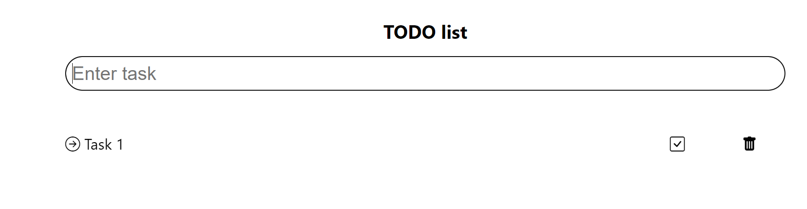

# TODO list app using REACT.js

This project was bootstrapped with [Create React App](https://github.com/facebook/create-react-app).

## Introduction

In the project directory, the todo  list application is built using React.js library and utilizes functional components to create reusable UI elements
The purpose of this application is to create a simple Todo List in which users can add tasks, mark them as completed and delete if necessary. The main features are:The aim of this project is to create a simple Todo List application in the form of a single page application

## Features

1. Adding the task
2. Mark as completed
3. Remove the task

## Learning

1. Hooks
2. Conditional rendering
3. Event handlers
4. Bubbling of event handlers

## Running the project

1. Clone the project from repository: git clone "http:url" (can get it from the repository)
2. npm i install to download all dependencies for running the application
3. npm  start to run the application in development mode. Open http://localhost:3000 to view it in the browser. The page will reload if you make edits. 
4. Open a web browser and go to http://localhost:3000 to see the application running

## Image

